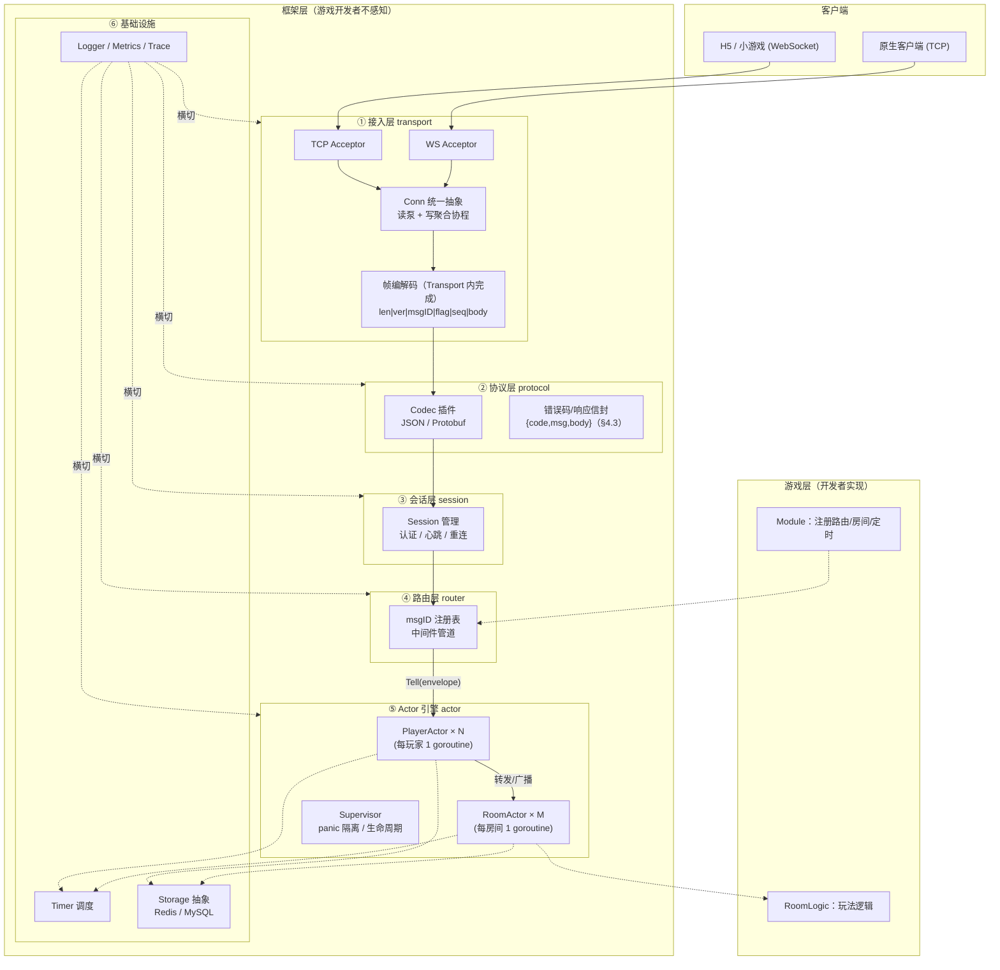
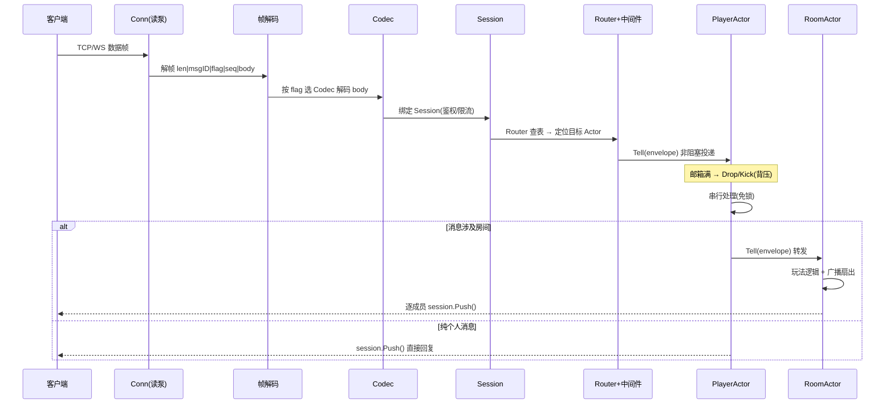
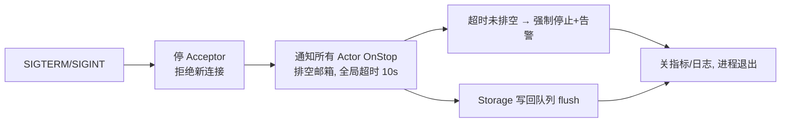
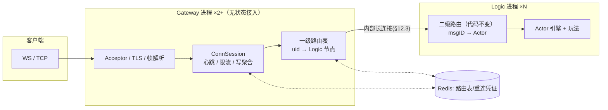
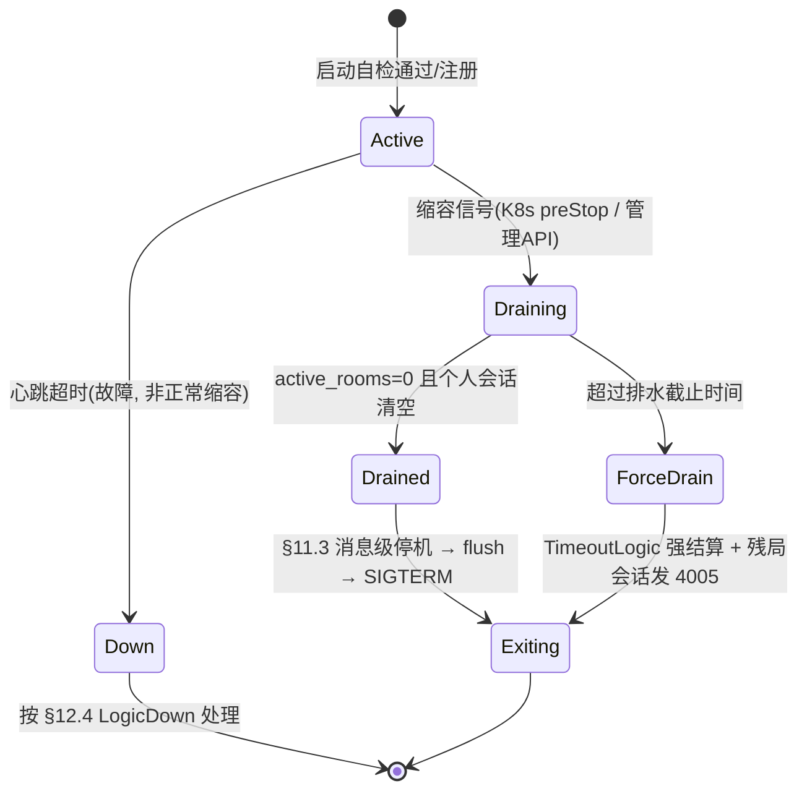

# 通用小游戏后端框架 — 架构设计文档

> 版本：v0.5（设计稿）　|　语言：Go 1.22+　|　状态：本期仅设计，不含实现
>
> v0.5 补充：玩家档案/游戏存档（§10.4：ProfileStore 接口、PlayerProfile 混合字段、周期 checkpoint + 退出强存、离线查询服务、PlayerActor 集成点、故障降级、schema）。
>
> v0.4 补充：多 module 混部容量估算示例（§13.10：成本单位模型、单节点瓶颈推导、HPA 阈值与副本数、排水余量校验）。
>
> v0.3 审查修订：新增弹性伸缩设计（§13：节点状态机/排水缩容、服务发现、分布式匹配、分配策略、HPA 信号、K8s 落地）；房间最长 TTL（§8.2）；新增伸缩指标（§11.2）。
>
> v0.2 审查修订：显式共享点清单（§7.5）、响应路径与错误码信封（§4.3/§6.1）、下行双通道重放（§5.3）、房间生命周期钩子（§8.1）、依赖故障降级（§10.3）、安全基线（§11.4）、可测试性（§15.4）、客户端接入契约（§16.5）。
>
> 一句话定位：**单机多核 Actor 模型的小游戏服务端框架**，WebSocket + TCP 双接入，可插拔序列化，以"每玩家/每房间一个 Actor"为核心并发模型，预留分布式演进接口。

---

## 目录

1. [概述](#1-概述)
2. [总体架构](#2-总体架构)
3. [接入层（Transport）](#3-接入层transport)
4. [协议与序列化（Protocol / Codec）](#4-协议与序列化protocol--codec)
5. [会话管理（Session）](#5-会话管理session)
6. [消息路由（Router）](#6-消息路由router)
7. [Actor 引擎（核心）](#7-actor-引擎核心)
8. [房间与匹配（Room / MatchMaker）](#8-房间与匹配room--matchmaker)
9. [定时器与调度（Timer）](#9-定时器与调度timer)
10. [数据持久化（Storage）](#10-数据持久化storage)
11. [可观测性与运维（Observability & Ops）](#11-可观测性与运维observability--ops)
12. [网关层设计（Gateway / Logic 拆分演进）](#12-网关层设计gateway--logic-拆分演进)
13. [弹性伸缩设计](#13-弹性伸缩设计)
14. [扩展指南：如何新增一个游戏](#14-扩展指南如何新增一个游戏)
15. [非功能设计](#15-非功能设计)
16. [附录](#16-附录)

---

## 1. 概述

### 1.1 设计目标

| 目标 | 含义 | 验收方式 |
|------|------|----------|
| **通用** | 不绑定具体玩法，能承载回合制卡牌、实时对战（贪吃蛇/坦克）、房休闲类等多种小游戏 | 新增一个游戏只需实现 `RoomLogic` + `Module` 两个接口 |
| **高并发** | 单机（4C8G）支撑 5 万长连接心跳、1w msg/s 业务消息 | 第 15 章压测方案 |
| **易扩展** | 模块可插拔、消息处理器可注册、存储/序列化可替换 | 第 14 章扩展指南走查 |
| **弹性** | Gateway 自动水平伸缩；Logic 支持排水式缩容、活动前预测扩容 | 第 13 章弹性伸缩设计 |

### 1.2 非目标（本期明确不做）

- ❌ **不做分布式实现**：本期不实现多进程部署、服务发现、跨节点 RPC，但已完成演进设计——Gateway/Logic 拆分见第 12 章，弹性伸缩（节点注册、排水缩容、分布式匹配）见第 13 章，演进点边界见 16.3；上述设计均不在本期编码。
- ❌ 不做网关聚合、不做跨服玩法（Gateway/Logic 拆分仅作为演进态设计，见第 12 章）。
- ❌ 不内置具体游戏逻辑（贪吃蛇等仅作为文档内的走查示例）。

### 1.3 术语表

| 术语 | 含义 |
|------|------|
| **Conn（连接）** | 一条底层网络连接（TCP 或 WebSocket），无业务语义 |
| **Session（会话）** | 一个玩家的逻辑会话，绑定 uid；可与 Conn 解绑重绑（支持重连） |
| **Actor** | 并发执行单元：独立 goroutine + 有界邮箱，内部状态串行处理 |
| **Mailbox（邮箱）** | Actor 的消息队列，有界 channel 实现 |
| **Envelope（信封）** | 投递到邮箱的最小消息单元：`{msgID, seq, payload, sender, meta}`；纯异步投递，无 replyCh（响应统一走 §4.3 信封与自动回包路径） |
| **错误码信封** | 统一响应/错误结构 `{code, msg, body}`，所有下行错误复用（§4.3） |
| **Codec** | 序列化插件（JSON / Protobuf），按消息头 flag 选择 |
| **Module** | 游戏业务装配单元，向 Registry 注册路由、房间、定时任务 |
| **RoomLogic** | 玩法逻辑接口，游戏开发者唯一需要实现的业务接口 |

---

## 2. 总体架构

### 2.1 分层架构图



### 2.2 一条消息的端到端流转

**上行**（客户端 → 服务器）：



**下行**：Actor 处理完后在**自己 goroutine 内**编码（`sync.Pool` 复用 buffer）→ 写入该 Conn 的写 channel → 每连接写聚合协程批量 flush。**任何 Actor 永不直接写网络**，写失败仅标记 Conn 待关闭。

---

## 3. 接入层（Transport）

### 3.1 Conn 统一抽象

TCP 与 WebSocket 差异被隔离在一个接口后面，上层（协议层/会话层）完全不感知：

```go
type Conn interface {
    ID() uint64
    // Read 返回下一个完整应用层数据帧（帧解析在实现内部完成）
    Read(ctx context.Context) ([]byte, error)
    // Push 非阻塞投递，由内部写协程异步刷出
    Push(data []byte) error
    Close(reason string) error
    RemoteAddr() string
    // Meta 读写连接级元数据（握手时的 token、 UA 等）
    Meta() *sync.Map
}
```

- **TCP 实现**：`bufio.Reader` + 长度前缀帧解析；开启 `TCP_NODELAY`（可配）。
- **WS 实现**：二进制消息类型，帧解析复用同一套 `FrameCodec`；叠加 RFC6455 协议层 ping/pong + 应用层心跳双保险。

> **帧解析归属（全文统一口径）**：len 拆包与帧头解析在 **Transport 内部完成**（§3.2 读泵第一步即解帧）；§2.1 图中「协议层」仅指 Codec 反序列化与 §4.3 信封构造。

### 3.2 每连接协程模型：1 读泵 + 1 写聚合

```
┌──────────────┐      ┌─────────────┐      ┌──────────────────┐
│ connReader    │ ──▶  │ 帧解码+解码  │ ──▶  │ Router → Actor   │   (每连接 1 个读 goroutine)
└──────────────┘      └─────────────┘      └──────────────────┘
┌──────────────┐      ┌─────────────┐
│ connWriter    │ ◀──  │ 写 channel  │ ◀── 各 Actor Push()       (每连接 1 个写 goroutine)
│ 聚合批量 flush │      └─────────────┘
└──────────────┘
```

- **读泵**：阻塞读 → 解帧 → 走上行链路；读错误/超时 → 关连接并通知 Session。
- **写聚合**：写 channel 攒批（例如 ≤ 4KB 或 ≤ 8 条或 2ms 超时先到者触发），一次 `writev`/单次 `Write` 刷出，显著降低小包 syscalls。
- 写 channel 满视为客户端过慢 → 标记慢消费者 → 按 3.3 策略处理。

### 3.3 慢消费者与背压（连接级）

| 情形 | 策略（可配置） |
|------|----------------|
| 写 channel 满 | 默认 `Kick`（关连接，客户端走重连）；可选 `DropNewest`（丢下行并记指标） |
| 读速率超限 | 令牌桶 per-conn 限流，超限先缓冲，持续超限 Kick |
| 单帧超限 | 超过 `maxFrameSize`（默认 64KB）直接 Kick，防恶意大包 |

### 3.4 TLS

Acceptor 级配置项：`tcp.tls.enabled / cert / key`、`ws.tls`（wss）。TLS 握手发生在 Acceptor，Conn 抽象不变。

- WS 握手同时校验 `Origin` 白名单（防跨站 WebSocket 劫持），见 §11.4 安全基线。

---

## 4. 协议与序列化（Protocol / Codec）

### 4.1 帧格式（应用层，TCP/WS 共用）

```
┌────────┬────────┬─────────┬────────┬────────┬──────────┬──────────┐
│ len    │ ver    │ msgID   │ flag   │ seq    │ routeLen │ route+body│
│ 4B     │ 1B     │ 4B      │ 1B     │ 4B     │ 2B       │ 变长      │
└────────┴────────┴─────────┴────────┴────────┴──────────┴──────────┘
```

| 字段 | 说明 |
|------|------|
| `len` | 后续全部字段总长（不含自身），用于 TCP 拆包 |
| `ver` | 协议版本（1B），登录帧协商确定，为协议升级留路 |
| `msgID` | 消息路由 ID（uint32），注册表主键 |
| `flag` | bit0-3：序列化类型（0=JSON，1=Protobuf，…可扩展）；bit4：压缩（gzip/snappy 预留）；bit5：是否需要 ack；bit6：快照类消息（latest-wins，不进重放缓冲，见 §5.3） |
| `seq` | 消息序号：上行去重 + 下行重放定位（见第 5 章） |
| `routeLen+route` | 可选的字符串路由（如 `"room.join"`），仅调试模式启用，生产走 msgID |

> WS 场景 `len` 字段冗余（WS 自带消息边界），实现中可跳过，但**编解码器对外行为一致**，上层无感。

### 4.2 Codec 插件接口

```go
type Codec interface {
    Type() byte                                 // 对应 flag bit0-3
    Marshal(msg any) ([]byte, error)
    Unmarshal(data []byte, msg any) error
}

// 框架内置
codec.Register(&JSONCodec{})     // Type=0
codec.Register(&ProtoCodec{})    // Type=1，基于 proto.Message 断言
```

- **协商规则**：上行帧的 `flag` 决定用哪个 Codec 解码——**服务端按帧适配，客户端决定序列化格式**；服务端下行默认沿用该会话上行的类型（记录在 Session）。
- Protobuf 路由表可由 `protoc` 插件生成 `msgID ↔ 消息结构` 的静态映射，避免运行时反射查表（生成器属于后续工程化内容，本期文档只定接口）。

### 4.3 错误码与响应信封

所有下行错误与 RPC 式响应使用统一信封，客户端 SDK 按同一结构解析：

```
{ code: uint16, msg: string, body: bytes }    // body 可选，为业务数据（按会话 Codec 编码）
```

| code 分段 | 含义 | 示例 |
|-----------|------|------|
| 0 | 成功 | — |
| 1xxx | 协议/参数错误 | 1001 未知 msgID、1002 解码失败、1003 帧超限 |
| 2xxx | 会话/鉴权错误 | 2001 未登录、2002 token 失效、2003 限流、2004 被踢 |
| 3xxx | 房间/业务错误 | 3001 不在房间、3002 房间已满、3003 对局已开始 |
| 4xxx | 服务端错误 | 4001 内部错误、4002 服务过载（背压触发）、4005 维护/停机通知 |

- Handler 返回的 `err` 由框架统一映射为信封 `code`（框架定义 `*ErrCode` 类型承载映射），非空 `resp` 编码进 `body`；
- 错误信封附**原请求 seq**，客户端可做请求级关联；
- 完整错误码表随实现维护在 `pkg/framework/errcode.go`，文档只锁定分段规则。

---

## 5. 会话管理（Session）

### 5.1 Session 与 Conn 解绑

```
登录成功：Session(uid) ──bind──▶ Conn#A
连接抖动：Conn#A 断开 ──▶ Session 保留(宽限期 T_KeepAlive, 默认 60s)，PlayerActor 不销毁
断线重连：Conn#B 携 reconnectToken ──▶ 鉴权 ──▶ Session 重绑 Conn#B ──▶ 按 seq 重放未确认下行
宽限期超时：Session 释放 ──▶ PlayerActor 收 OnStop，房间内自动托管/逃跑结算（由玩法决定）
过期找回：Session 释放时写 Redis recover:room:{uid} → {roomID,token}（TTL=单局最长时长）；
          玩家重新登录后框架命中该键 → 下发 RecoverableRoom 提示 → 客户端重新进房，
          走玩法的断线重进逻辑（§8.1 OnJoin）
```

**核心不变式：`PlayerActor` 的生命周期跟随 Session 而非 Conn。** 网络抖动不丢失内存态（房间中的牌局、移动状态）。

### 5.2 心跳

- 应用层 `ping/pong` 消息（msgID 固定），间隔 15s，2 次未收到判死；
- TCP 叠加 `SetReadDeadline`；WS 叠加协议层 ping；
- 心跳处理在**连接读泵**直接回复（不进 Actor 邮箱），避免业务繁忙时心跳被饿死导致误踢。

### 5.3 重连与重放

- 登录成功颁发 `reconnectToken`（Redis 存储，TTL = 宽限期）；
- **下行双通道**（解决高频快照淹掉可靠消息的问题——20fps 快照 12.8s 即滚满 256 条缓冲，可靠消息会被挤掉）：
  - **可靠通道**：需重放保障的下行（结算、踢人、系统通知等）进「已下发未确认」环形缓冲（容量可配，默认 256 条），带 seq；
  - **快照通道**：高频状态同步标记帧 `flag` bit6（§4.1），**latest-wins**——Session 仅缓存每个 msgID 最新一条，不占环形缓冲，重连后客户端直接拉取各 msgID 最新快照；
- 消息分类（可靠/快照）由 Module 注册消息时声明，默认可靠；
- 重连后客户端上报可靠通道最后收到的 `seq`，服务端重放差额；
- 可靠通道溢出（离线期间可靠消息超过缓冲容量）→ 放弃重放，通知客户端走全量同步（各玩法实现 `Resync` 消息）。

---

## 6. 消息路由（Router）

### 6.1 注册表（非反射）

```go
type HandlerFunc func(ctx *MsgCtx, req any) (resp any, err error)

func (r *Router) Register(msgID uint32, reqFactory func() any, h HandlerFunc)
func (r *Router) Use(mw ...Middleware)      // 中间件链
```

选型理由：**注册表 + 工厂函数**而非反射——编译期可查、零反射开销、配合 protoc 生成器可全自动绑定。

**响应路径（与 Actor 异步模型对齐）**：Handler 在 Actor goroutine 内执行；返回非空 `resp` 时，框架在**同一 goroutine 内**按会话 Codec 编码、附原请求 seq、经 `session.Push()` 异步回包；返回 `err` 时按 §4.3 错误码信封回包。Handler 自身永不阻塞、永不直接写网络。

**两套路由 API 的分工**（§14 示例即按此使用）：
- **个人消息**：`router.Register(msgID, factory, HandlerFunc)` —— Handler 处理并返回 resp，自动回包；
- **房间消息**：`reg.Route(msgID, factory, ToRoom())` —— 第三个参数仅声明**投递目标**（进 RoomActor 邮箱）；业务逻辑在 `RoomLogic.OnMessage` 内按 msgID switch 分发，框架对房间消息**不做** Handler 注册（避免分发逻辑两处维护）。

### 6.2 路由的两级定位

1. **目标 Actor 定位**：`msgID → {个人消息 | 房间消息}` 由 Module 注册时声明：
   - 个人消息 → `uid → PlayerActor`；
   - 房间消息 → `session.roomID → RoomActor`（未在房间则回错误码）。
2. **业务处理**：Envelope 进入 Actor 邮箱后，Actor 内部再按 msgID 分发到具体 Handler。

### 6.3 中间件管道

按序执行，任意环节可短路：

| 内置中间件 | 职责 |
|-----------|------|
| Recover | panic 捕获 → 记日志+指标 → 通知 Supervisor |
| RateLimit | 令牌桶（per-conn + 全局两级） |
| Auth | 登录前仅放行 `login/reconnect/ping` 三类 msgID |
| Trace | 生成/透传 traceID，注入 MsgCtx，日志与指标自动携带 |
| Metric | handler 耗时、QPS 上报 |

---

## 7. Actor 引擎（核心）

### 7.1 Actor 接口与生命周期

```go
type Actor interface {
    Init(ctx *ActorCtx)                       // 启动时调用一次
    OnMessage(ctx *ActorCtx, env *Envelope)   // 串行处理每条消息
    OnStop(ctx *ActorCtx)                     // 停机/会话超时销毁时调用
}

type ActorCtx interface {
    Self() ActorID
    Tell(target ActorID, env *Envelope) error // 跨 Actor 唯一通信方式
    Session() Session                         // PlayerActor 专属
    Storage() Storage                         // 持久化门面
    Spawn(child Actor) ActorID                // 父子监督（Room 挂在 RoomManager 下）
}
```

生命周期：`Spawn → Init → (OnMessage × N) → OnStop`。钩子均在 Actor 自己的 goroutine 内执行，**钩子内禁止阻塞**（存储走异步，网络走 Tell/Push）。

### 7.2 邮箱与调度

```
                 ┌─────────────────────────────┐
 Router ──Tell──▶│ Mailbox (chan *Envelope,    │──▶ for { drain ≤K 条/轮
                 │            cap=1024 可配)   │        处理 → 检查水位/退出信号 }
                 └─────────────────────────────┘
```

- **有界 channel**：容量默认 1024，按 Actor 类型可配（RoomActor 可调大）。
- **批量 drain**：每轮 `select` 尽量取空邮箱但最多 K 条（默认 64），降低 goroutine 调度与锁竞争开销，广播类场景收益显著。
- **背压策略**（邮箱满时，按 Actor 级配置）：
  - `Drop`（默认）：丢最新一条 + `drop_total` 指标 + 采样日志；适合可丢消息（心跳/位置同步）；
  - `Kick`：给客户端回错误码并断会话；适合强一致消息（下注/出牌）；
  - `Block`：带超时阻塞投递——**仅限框架内部停机排空路径使用，业务路由禁止**。
- **房间消息的背压语义**：RoomActor 邮箱满触发 `Kick` 时**不踢全房间**——对触发消息的来源玩家回 4002（§4.3）并按其个人会话策略处理；广播扇出写满某成员 Conn 时走 §3.3 连接级策略（仅该成员被 Kick/Drop）。
- **水位监控**：`mailbox_len` 直方图 + 持续超阈值（如 >80% 达 5s）触发告警指标，定位慢 Actor。

### 7.3 并发安全红线（框架最高原则）

1. **Actor 内的状态只被本 Actor 的 goroutine 访问** —— 免锁，这是整个框架性能的根基；
2. **跨 Actor 只能传消息，禁止传可变指针/引用**（Envelope 中 payload 若为对象，视作所有权转移，接收方独占）；
3. 全局只读数据（配置表）启动后只读，或用 `atomic`；
4. 违反 1/2 的后果：数据竞争、诡异偶现 bug、压测不出来的线上事故——框架在 race detector 下提供测试基线，文档要求业务侧 review 时对照检查。

### 7.4 panic 隔离与 Supervisor

- Actor 的 `OnMessage` 外层统一 recover：单条消息 panic 不拖垮进程；
- Supervisor 记录连续 panic 次数，超阈值（默认 3 次/分钟）→ 关闭该 Actor + 会话踢出 + 告警，防止 panic 风暴；
- 父子监督：RoomActor 由 RoomManager（也是一种 Actor）Spawn，子异常退出时父级收到 `ChildDown` 事件做结算/回收。

### 7.5 显式共享点清单（红线 1 的唯一例外）

以下三处是框架内**仅有的跨 goroutine 共享状态**，均已内置同步保护；除本清单外，任何共享可变状态都违反 §7.3：

| 共享点 | 访问者 | 同步机制 |
|--------|--------|----------|
| **Session 下行缓冲**（seq 分配 + 可靠环形缓冲 + 快照缓存） | 所属 PlayerActor、广播扇出时的 RoomActor | Session 内部细粒度 mutex（临界区仅指针/序号操作） |
| **Actor 注册表**（uid→PlayerActor、roomID→RoomActor） | 读泵/路由（读），RoomManager/Supervisor（写） | `sync.RWMutex`（读多写少） |
| **Conn 写 channel** | 任意 Actor（Push）、连接写协程（消费） | channel 自身同步 |

> 设计含义：广播扇出时 RoomActor 与 PlayerActor 会在 Session mutex 上短暂串行——**这是有意的取舍**，保证下行 seq 单调与重放正确性。临界区不含编码与 IO（编码已在 Actor goroutine 内完成，Push 只投递已编码字节），不构成瓶颈；§15.1 广播风暴场景专门验证此点。

---

## 8. 房间与匹配（Room / MatchMaker）

### 8.1 RoomActor 通用骨架

框架提供通用骨架，玩法只填 `RoomLogic`：

```go
type RoomLogic interface {
    OnCreate(r *RoomCtx, cfg RoomConfig)            // 房间创建：初始化玩法状态（如 r.SetKV("state", NewSnakeState())）
    OnJoin(r *RoomCtx, p Player)                    // 进房（含断线重进）
    OnMessage(r *RoomCtx, p Player, env *Envelope)  // 玩法消息
    Tick(r *RoomCtx, dt time.Duration)              // 帧驱动（实时类玩法用）
    OnLeave(r *RoomCtx, p Player)                   // 离开（含掉线托管判断）
    OnEmpty(r *RoomCtx)                             // 空房回收
    OnDestroy(r *RoomCtx)                           // 房间销毁：结算落库兜底、状态清理
}
```

- `RoomCtx` 内置：成员表、广播 `Broadcast(msgID, msg, exceptUID...)`、踢人、房间 KV 状态（`KV/SetKV`——仅 RoomActor goroutine 访问，免锁）、定时器快捷入口。
- 广播实现：在 RoomActor goroutine 内遍历成员 → 逐个 `playerActor.Tell()` 或直接 `session.Push()`（二者由成员在线状态决定），**无共享广播锁**。

```go
// 可选扩展：房间到达 MaxDuration 时的强制结算钩子（§8.2 TTL 配套）
type TimeoutLogic interface {
    OnTimeout(r *RoomCtx) // 实现后由框架在 TTL 到期时回调；返回后房间进入销毁流程
}
```

### 8.2 RoomManager 与匹配

- `RoomManager`：房间表（`roomID → RoomActor`）、空房延迟回收（Tick 检查 `OnEmpty`）、房间数指标；
- **房间最长 TTL**（`RoomConfig.MaxDuration`，按玩法配置，如 15min）：房间创建即注册兜底定时器，超时触发可选的 `TimeoutLogic` 钩子（下）做强制结算；未实现该钩子则直接销毁房间。作用：防卡死/挂机房间泄漏内存，并为弹性缩容提供排水时间上界（§13.3）；
- `MatchMaker` 为接口（`Enqueue(player, rule) → roomID`），框架内置最简队列匹配（按分数段/人数），复杂匹配（ELO、跨池）由业务自实现——匹配逻辑跑在独立的 MatchMaker Actor 中，不阻塞玩家 Actor。多实例部署时该接口替换为分布式实现（§13.5）。

---

## 9. 定时器与调度（Timer）

**选型对比**：

| 方案 | 优点 | 缺点 | 结论 |
|------|------|------|------|
| 最小堆（container/heap） | 实现简单、精确、删除方便 | 万级定时器下插入 O(logN) | ✅ **采用**（小游戏规模足够） |
| 时间轮 | O(1) 插入，海量定时器友好 | 精度/层级复杂，删除不便 | 预留接口，不做 |

设计要点：

- 全局一个 `TimerScheduler` goroutine（堆 + `time.Timer` 精确唤醒）；
- **回调不是直接执行，而是 `Tell` 到所属 Actor 的邮箱** —— 保证定时器逻辑与该 Actor 其他消息串行，杜绝竞态；
- Actor 生命周期与定时器绑定：Actor 销毁自动取消其全部定时器（Actor 级定时器表）；
- `RoomLogic.Tick` 是语法糖：框架为 RoomActor 注册周期定时器（帧间隔可配，默认 50ms = 20fps 逻辑帧）；
- **Module 级 Cron**（§14 的 `reg.Cron(expr, fn)`）：框架为每个 Module 启动一个 Module Actor 承载其定时任务，cron 到点 → 投递到该 Actor 邮箱执行（与其他 Actor 串行模型一致）；回调内如需作用于房间/玩家，`Tell` 对应 Actor 即可。

---

## 10. 数据持久化（Storage）

### 10.1 接口抽象

```go
type Storage interface {
    Get(ctx context.Context, table, key string, out any) error
    Set(ctx context.Context, table, key string, val any) error
    Del(ctx context.Context, table, key string) error
    // 原子计数：货币扣减等
    IncrBy(ctx context.Context, table, key string, delta int64) (int64, error)
    // 排行榜子接口（Redis 用 ZSet 适配；MySQL 用有序表实现）
    Ranking() Ranking
}

type Ranking interface {
    ZAdd(ctx context.Context, table, member string, score int64) error
    ZIncrBy(ctx context.Context, table, member string, delta int64) (int64, error)
    ZRevRange(ctx context.Context, table string, start, stop int64) ([]RankItem, error)
    ZRank(ctx context.Context, table, member string) (int64, error)
}
```

### 10.2 存放划分与写回策略

| 数据 | 存储 | 理由 |
|------|------|------|
| 会话/重连 token、排行榜 | Redis | TTL 天然匹配宽限期；ZSet 天然匹配排行 |
| 账号、资产流水、对局记录 | MySQL | 强一致 + 可审计 |
| **玩家档案**（等级/货币/成就/设置/extra，§10.4） | Redis（热数据 Hash + JSON）+ MySQL（兜底强一致） | 玩家不在线时仍需查询（§10.4.3）；登录加载走 Redis，结算/退出强存双写 |
| 房间内实时状态 | **只存内存**（RoomActor） | 换取性能；靠第 5 章宽限期 + 玩法定义的恢复策略兜底 |

- **异步写回**：Actor 内调 `Storage.Set` 实际入写回队列（有界），后台批量 flush；写失败重试 + 死信日志。Actor 内**永不同步等 IO**；
- 货币类强一致操作例外：提供 `Sync` 变体（同步路径，带超时），业务显式选择，文档警示性能代价；
- **Raw 逃生口**：`Storage.Raw() any` 返回底层客户端（如 `*redis.Client`）供 Pipeline/事务等高级用法。⚠️ 经 Raw 的调用**绕过异步写回与熔断保护**（同步直达），超时与重试由业务自负，仅限异步接口覆盖不了的场景。

### 10.3 依赖故障与降级

| 故障 | 影响 | 行为 |
|------|------|------|
| Redis 不可用 | 登录/重连 token、排行榜不可用 | 登录与重连**直接失败**回 4xxx（会话安全不降级绕过）；已在线会话不受影响（token 已校验、会话态在内存）；排行榜写失败入死信日志 |
| MySQL 不可用 | 异步写回阻塞 | 写回队列（有界）堆积 → 触发溢出策略（下） |
| 写回队列溢出 | 持久化丢失风险 | 二级降级：① 溢出数据落**本地 WAL**（追加写，进程恢复后重放）；② WAL 也失败 → 死信日志 + **熔断**（按 table 拒绝新的异步写入，业务收降级错误码），防内存无界增长 |
| 熔断恢复 | — | 半开探测：后台探测成功自动恢复；熔断期间的内存态由业务决策重试或丢弃（资产类建议配合对账） |

### 10.4 玩家档案（PlayerProfile / 游戏存档）

§10.1–10.3 给出的是**通用 KV/计数/排行**抽象，没有"玩家档案"概念：玩家不在线时无统一查询入口、登录时无加载钩子、退出时无强存保证。本节补这一层。

**定位**：玩家档案 = 跨会话持久化的玩家级数据（等级/货币/成就/设置/游戏内进度等），与对局历史（§10.2 表中"对局记录"）正交。档案随 uid 而非随房间存在。

#### 10.4.1 接口抽象

```go
// ProfileStore 玩家档案存取接口（业务内调用，PlayerActor goroutine 内访问）
type ProfileStore interface {
    // Load 登录或重连时加载档案；不存在返回零值档案（首次登录）
    Load(ctx context.Context, uid string) (*PlayerProfile, error)
    // Save 增量写入（走 §10.2 异步队列）
    Save(ctx context.Context, uid string, p *PlayerProfile) error
    // SaveSync 强一致写入（走 §10.2 Sync 变体）；OnRelease/结算等关键路径使用
    SaveSync(ctx context.Context, uid string, p *PlayerProfile) error
    // Patch 部分字段更新（避免读-改-写竞态）
    Patch(ctx context.Context, uid string, fields map[string]any) error
}

// PlayerProfile 通用档案结构（混合字段策略）
type PlayerProfile struct {
    UID       string         `json:"uid" protobuf:"bytes,1,opt,name=uid,proto3"`
    Level     int32          `json:"level" protobuf:"varint,2,opt,name=level,proto3"`
    Exp       int64          `json:"exp" protobuf:"varint,3,opt,name=exp,proto3"`
    Coin      int64          `json:"coin" protobuf:"varint,4,opt,name=coin,proto3"`  // 货币类强一致，走 IncrBy 而非直接赋值
    Gem       int64          `json:"gem" protobuf:"varint,5,opt,name=gem,proto3"`
    Settings  map[string]any `json:"settings,omitempty" protobuf:"bytes,6,opt,name=settings,proto3"`  // 客户端设置
    Achievements []string    `json:"achievements,omitempty" protobuf:"bytes,7,rep,name=achievements,proto3"`
    Extra     map[string]any `json:"extra,omitempty" protobuf:"bytes,8,opt,name=extra,proto3"`  // 玩法自定义扩展面
    UpdatedAt int64          `json:"updated_at" protobuf:"varint,9,opt,name=updated_at,proto3"`  // ms 时间戳，单调性校验
}
```

- **混合字段策略**：通用字段（Level/Exp/Coin/Gem/Achievements）所有玩法共享；`Extra map[string]any` 留给玩法自定义（如蛇蛇的累计长度、卡牌的卡组清单）；
- **货币类禁止直接赋值**：Coin/Gem 等资产类必须走 `Storage.IncrBy`（原子计数），不能 `Save` 整个档案覆盖（避免读-改-写竞态丢失扣款）；
- **UpdatedAt 单调性**：并发写入时用 CAS 检查 UpdatedAt，旧值覆盖新值直接拒绝。

#### 10.4.2 落库语义：周期 checkpoint + 退出强存

| 时机 | 路径 | 说明 |
|------|------|------|
| 登录/重连 | `Load` | PlayerActor `OnSessionStart` 加载到内存态，玩法通过 `Player.Profile()` 读 |
| 游戏内修改 | 内存态 + `Save`（异步） | 不阻塞 Actor；走 §10.2 写回队列 |
| 周期 checkpoint | `Save`（异步） | 每 N 秒（玩法配置，默认 60s）兜底刷一次，防长时间未存档的崩溃丢失 |
| 玩家退出/被顶号 | `SaveSync`（强存） | `PlayerActor.OnRelease` 强制同步落库 + WAL 兜底，保证不丢档 |
| 房间结算 | `SaveSync` 或 `Patch` | `RoomLogic.OnDestroy` 内对参与玩家结算后强存（与 §10.2 "对局记录"同步写） |

- **周期 checkpoint 由 PlayerActor 自驱动**（用 §9 定时器 `Every`），不依赖外部扫描；
- **退出强存超时**：`SaveSync` 受 `Storage.SyncTimeout` 约束（默认 2s），超时按 §10.3 熔断/WAL 兜底；
- **WAL 兜底生效条件**：`Storage.wal_path` 配置非空；存档 table 命名约定 `player_profile`（统一表名，便于运维识别与对账）。

#### 10.4.3 离线查询入口（独立查询服务）

业务内查询通过 `Player.Profile()`（PlayerActor goroutine 内）即可；玩家不在线时需独立查询服务：

```go
// ProfileQueryService 独立查询服务接口（玩家不在线时使用）
// 实现方式：① admin HTTP API（/admin/players/{uid}）；② 独立 gRPC 服务
// 安全基线：仅内网/可信调用方访问（§11.4 ipGuard + mTLS）
type ProfileQueryService interface {
    Query(ctx context.Context, uid string) (*PlayerProfile, error)
    BatchQuery(ctx context.Context, uids []string) (map[string]*PlayerProfile, error)
    Leaderboard(ctx context.Context, metric string, limit int) ([]RankItem, error)
}
```

- **不读 PlayerActor**：玩家不在线时 PlayerActor 不存在，直接查 Storage；
- **缓存层**：高频查询可加进程内 LRU（与 §10.2 Redis 缓存正交），TTL 由业务定；
- **依赖方向**：查询服务依赖 `Storage` 接口，不依赖 `internal/actor`，避免循环。

#### 10.4.4 PlayerActor 集成点

| 钩子 | 调用 | 说明 |
|------|------|------|
| `OnSessionStart(uid)` | `profileStore.Load` → 写入 PlayerActor 内存态 | 登录/重连统一入口，幂等 |
| `Every(checkpointInterval)` | `profileStore.Save` | 周期 checkpoint |
| `OnRelease()` | `profileStore.SaveSync` | 退出强存（顶号/宽限超时/主动下线）|
| `RoomLogic.OnDestroy` | `profileStore.Patch` 或 `SaveSync` | 房间结算回写档案 |

- **`OnRelease` 必须强存**：避免顶号场景下旧 PlayerActor 退出但档案未落库，新 PlayerActor `Load` 拿到旧值；
- **顶号顺序**：旧 PlayerActor `OnRelease`（强存）→ 新 PlayerActor `OnSessionStart`（Load 拿到最新值）→ 旧连接被踢（§4.3 ErrKicked 2004）。顺序由 `SessionManager.TopKick` 保证。

#### 10.4.5 故障与降级

| 故障 | 行为 |
|------|------|
| `Load` 失败（Redis/MySQL 不可用） | 登录**直接失败**（不降级绕过，与会话 token 同口径 §10.3） |
| `Save` 异步入队失败 | 走 §10.3 写回队列溢出 → WAL 兜底 |
| `SaveSync` 超时 | WAL 兜底 + 熔断（按 `player_profile` table）；玩家退出被阻塞至超时，可接受 |
| WAL 也失败 | 死信日志 + 告警；玩家内存态仍可用，下次登录重新加载（可能丢失最后一次修改） |

#### 10.4.6 数据模型（参考 schema）

MySQL DDL 示例（Redis 走 Hash + JSON 序列化）：

```sql
CREATE TABLE player_profile (
    uid        VARCHAR(64)  PRIMARY KEY,
    level      INT          NOT NULL DEFAULT 1,
    exp        BIGINT       NOT NULL DEFAULT 0,
    coin       BIGINT       NOT NULL DEFAULT 0,
    gem        BIGINT       NOT NULL DEFAULT 0,
    settings   JSON         NULL,
    achievements JSON       NULL,
    extra      JSON         NULL,
    updated_at BIGINT       NOT NULL DEFAULT 0,
    INDEX idx_updated (updated_at)
);
```

---

## 11. 可观测性与运维（Observability & Ops）

### 11.1 日志与追踪

- 结构化日志（slog/zap 均可），必带字段：`traceID, uid, roomID, msgID, actorID`；
- traceID 在接入层中间件生成，随 Envelope 透传，跨 Actor 不丢失；
- 内置 pprof HTTP 端点（独立端口，生产需内网限制）。

### 11.2 Prometheus 指标清单

| 指标 | 类型 | 用途 |
|------|------|------|
| `online_connections` | Gauge | 在线连接数 |
| `online_sessions` | Gauge | 有效会话数 |
| `msg_qps{dir=up/down}` | Counter | 上下行 QPS |
| `handler_duration_ms` | Histogram | 处理耗时（P99 关注） |
| `mailbox_len` | Histogram | 邮箱水位（慢 Actor 定位） |
| `mailbox_drop_total` / `kick_total` | Counter | 背压触发次数 |
| `rooms` / `actors` | Gauge | 房间数/Actor 数 |
| `active_rooms{node,module}` | Gauge | 进行中房间数（Logic 排水与 HPA 核心信号，§13.7） |
| `match_queue_depth{module}` | Gauge | 匹配队列深度（扩容领先指标） |
| `node_state{node,role}` | Gauge | 节点状态：1=Active / 0.5=Draining / 0=Drained |
| `panic_total` | Counter | panic 次数 |

### 11.3 优雅停机



> 本节是**消息级停机**（排空邮箱，秒级）。弹性场景的**房间级排水**（等待对局自然结束，分钟级，含 Draining 状态机）见 §13.3，两者层级不同、在缩容流程中先后衔接。

### 11.4 安全基线

| 项 | 要求 |
|----|------|
| WS Origin 校验 | WS 握手校验 `Origin` 白名单（可配），防跨站 WebSocket 劫持；不匹配直接拒绝握手 |
| reconnectToken 防重放 | **一次性消费**：重连成功即删除旧 token 并颁发新 token；重放旧 token 拒绝并告警 |
| 登录接口防护 | `login/reconnect` 独立限流桶（严于全局，默认 1 req/s/conn）；登录帧尺寸单独上限（默认 4KB） |
| 帧级防护 | 沿用 §3.3：`maxFrameSize` 64KB、两级令牌桶 |
| 服务端权威 | 货币/资产变更只接受服务端结算结果；客户端消息仅作请求，玩法层遵守（防篡改的前提） |

---

## 12. 网关层设计（Gateway / Logic 拆分演进）

> 定位：框架默认形态为**单机架构**，网关功能内嵌于进程（即 §3 接入层 + §5 会话 + §6 路由）。本章定义规模/可用性超出单进程上限时的**拆分演进设计**——即 §16.3 演进预留点的完整展开。核心约束：**对游戏业务代码零改动**（Module/RoomLogic/Actor 接口不变，仅装配入口与部署拓扑变化）。
>
> **实现状态（截至当前）**：拆分骨架已落地并通过真实 TCP 双节点端到端测试，可按 `deploy/k8s/` 清单部署：
>
> | 能力 | 状态 | 实现落点 |
> |------|------|---------|
> | 角色分派装配（gateway/logic） | ✅ | `app.BuildGateway` / `app.BuildLogic`（`server.role`） |
> | 一级路由表（进程内） | ✅ 骨架 | `gateway.MemRouteTable`（uid→nodeID，watch 注册表失效） |
> | 一级路由表（Redis 共享） | ⏳ 下一阶段 | 多 Gateway 副本前提；当前双副本需待 RedisRouteTable |
> | 内部 Transport（进程内） | ✅ | `MemNodeTransport`（同进程骨架直达） |
> | 内部 Transport（真实 TCP） | ✅ | `TCPNodeTransport`，`cluster.internal_addr` 非空启用 |
> | Gateway 侧收发 | ✅ | `app.GatewayConnector`：登录选节点/业务帧转发/下行回写/心跳直回 |
> | Logic 侧收发 | ✅ | `app.LogicHandler`：登录建会话、重连重放、业务帧进 router |
> | Logic 侧下行端点 | ✅ | `session.RemoteConn`（实现 `transport.Conn`，Push 经内部链路回传） |
> | 重连节点路由 | ✅ | 重连 token = `nodeID:原始token`；无前缀时广播 Active 节点兜底 |
> | LogicDown 主动通知 | ⏳ | 注册表 Down 事件已能 Invalidate 本地表；客户端通知待下一阶段 |
> | ConnSession/PlayerSession 显式拆分 | ⏳ | 当前以 GatewayConnector + RemoteConn 两个端点承担同等职责，业务语义不变 |


### 12.1 何时需要拆分

| 信号 | 说明 |
|------|------|
| 连接规模超限 | 在线连接逼近单 Logic 进程容量（~10w，见 §15 性能目标） |
| 发版不断线 | Logic 重启不能踢掉在线连接——连接需锚定在独立进程 |
| 按域扩展 | 按玩法/大区部署多套 Logic 集群 |
| 安全收敛 | 外网只暴露 Gateway，Logic 全内网隔离 |

### 12.2 拆分后拓扑与职责边界



| 职责 | 单机（本期） | 拆分后 |
|------|--------------|--------|
| Acceptor / TLS / 帧解析 | §3 本进程 | Gateway |
| 心跳 / 限流 / 写聚合 | §3 §5 | Gateway（连接级，机制不变） |
| Session 逻辑状态 | §5 本进程 | 拆为 ConnSession（Gateway）+ PlayerSession（Logic），对 `ActorCtx.Session()` 使用者透明 |
| msgID → Actor 路由 | §6 | Logic，**代码不变** |
| Actor 引擎 / 玩法 | §7 §8 | Logic |
| Codec | §4 | Gateway 只解析帧头、不碰 body；两侧共用同一实现 |

**核心原则：Gateway 是"哑管道"**——只解析帧头（len/msgID/seq/uid），永不反序列化玩法消息。收益：Gateway 不随玩法发版、无业务逻辑、可独立水平伸缩。

### 12.3 内部协议（Gateway ↔ Logic）

- **复用 §4.1 帧格式**，帧头前增加内部路由段 `innerHeader`：`{uid, sessionID, gatewayID, msgType: Unicast|RoomBroadcast, forwardSeq}`；该段仅存在于内部链路，对客户端不可见；
- 内部连接是 `Transport` 接口的又一实现（node-to-node Transport），与客户端 WS/TCP 实现共享帧编解码与写聚合机制；

**实现约定（当前落地形态）**：

| 项 | 约定 |
|----|------|
| 传输 | `gateway.TCPNodeTransport`：每节点一个 TCP 监听（K8s 约定容器端口 **7002**），对端懒拨号 + 长连接复用；`cluster.internal_addr` 留空则退回进程内 `MemNodeTransport`（同进程骨架/集成测试） |
| 线格式 | `[4B 大端 payloadLen][innerHeader 文本前缀 "uid\|sessID\|gwID\|msgType\|seq\n"][§4.1 原始帧]`；多 envelope 可在同一 TCP 段聚合，接收方按长度前缀切流 |
| 写聚合 | 与客户端连接同机制：首帧触发 2ms 攒批窗口 / 4KB 上限；出站写失败自动清连接重拨一次 |
| 断连检测 | 每连接一个只读协程消费数据：TCP 半关闭下写可能先进内核缓冲，读 EOF 是唯一可靠关闭信号，检测到即标记连接死亡 |
| 寻址 | 节点不预拨号簿：目标地址查 NodeRegistry 注册条目的 `Addr`（即 `internal_advertise_addr`，K8s 注入 `${POD_IP}:7002`）；监听地址 `:7002` 是通配形式，不能作为拨号目标 |
| 入站分发 | 入站帧按发送方 nodeID（转发时加盖的来源 ID）查具名 handler；对端副本动态扩缩无法预注册，故另有"默认 handler"兜底——GatewayConnector 与 LogicHandler 均注册为各自节点的默认入口 |

- **下行广播扇出**两种模式（配置切换）：

| 模式 | 机制 | 适用 |
|------|------|------|
| 逐成员路由（默认） | RoomActor 广播 → 逐成员 `session.Push()` → 内部链路按 uid 投到所属 Gateway → Gateway 本地写对应 Conn | 简单、Gateway 无房间状态；8 人房内部放大约 8 倍，可接受 |
| 组播组（大房间优化） | Gateway 维护 `roomID → uid → Conn` 表，Logic 只发一份 + roomID，Gateway 本地扇出 | >100 人房间，省内部带宽，代价是 Gateway 持有房间状态 |

### 12.4 会话路由与粘性

- **路由表**：`{module}:uid → LogicNode` 存 Redis + Gateway 本地缓存；登录/重连时由 Logic 写入。分配策略见 §13.6（粘性不迁移 + 新房按最少活跃房间加权），取代简单一致性哈希——弹性场景节点增减不搬迁存量会话；
  - **当前实现**：`MemRouteTable` 为进程内映射（演进骨架），登录成功后由 **GatewayConnector** 写入本地表；Logic 侧尚不需要写（同进程/单网关副本下路由表就在 Gateway 本地）。升级为多 Gateway 副本时按本节契约改为 Redis 共享表、写入主体迁回 Logic（会话建立的唯一知情方），Gateway 退为只读 + 短 TTL 本地缓存；
  - 骨架阶段 Gateway 登录时需解析登录请求体取 uid 以建立下行连接索引，属"哑管道"原则的**唯一例外**（仅登录帧、仅取 uid 字段，不触碰玩法 body）；
- **按玩法分区**：路由键带 module 维度，snake/card 等玩法可落到独立 Logic 集群、独立 HPA（§13.6）；
- **同房同节点**：房间类玩法要求同房成员在同一 Logic 进程——`RoomManager` 分配 roomID 时写 `roomID → node`，Gateway 对房间消息按 roomID 路由；跨节点组房由 MatchMaker 在分配时完成成员落点（不让房间运行中迁移）；
- **Logic 宕机**：节点心跳超时 → Gateway 向该节点全部会话下发 `LogicDown` 错误码 → 客户端静默重连（走 §5 重连通道）→ 新节点恢复；账号/资产态在 Redis/MySQL 不丢，房间实时态按 §10.2 的取舍处理。当前已落地：注册表 Down 事件 → 路由表 `Invalidate(nodeID)` 清除指向该节点的映射；主动下发 LogicDown 通知待下一阶段；
- **重连路由**：Logic 登录响应中的 `reconnect_token` 形如 `nodeID:原始token`，Gateway 重连时直接按前缀路由到原 Logic 节点，不查路由表；前缀缺失（旧 token/异常）时广播到全部 Active Logic 节点由其校验，成功即恢复。

### 12.5 滚动发版（发布重启不掉线）

两级体验，本期演进目标为 L1：

| 级别 | 机制 | 用户体感 |
|------|------|----------|
| **L1 通知式** | Logic 优雅停机（§11.3）→ Gateway 感知节点下线 → 对受影响 uid 下发重连通知 → SDK 静默重登新节点（自动重连 + 状态恢复，走 §5 通道） | 秒级卡顿、无掉线弹窗；休闲/回合制达标 |
| **L2 迁移式**（本期不做，标注边界） | Actor 状态快照外置 → 新节点载入恢复 | 完全无感；需状态序列化框架，成本高 |

发版节奏约束：实时对战类玩法建议在匹配低峰或局间窗口发版，配合 L1。

### 12.6 对框架接口的影响（兑现 §16.3 演进点）

| 演进点 | 单机实现 | 拆分后 | 业务感知 |
|--------|----------|--------|----------|
| `ActorID` | 进程内 `uint64` | `{nodeID, localID}` 复合 ID，Router 目标解析改查路由表 | **无**（业务只见不透明 ID） |
| `Transport` | 进程内 WS/TCP | 增加 node-to-node 实现，同一 `Conn` 抽象 | **无** |
| `Session` | 单一 Session | ConnSession + PlayerSession，重绑协议不变 | **无**（`ActorCtx.Session()` 语义不变） |
| 装配入口 | `framework.New(...).Run()` | `framework.NewGateway(cfg)` / `framework.NewLogic(cfg)` 两个 main | main 一行差异 |
| `MatchMaker` | 进程内 Actor | 可独立部署为服务，接口不变 | **无** |

### 12.7 拆分后全链路（演进态走查）

- **上行**：C → Gateway 帧头解析 → 查一级路由表 → 内部链路 → Logic Router（§6 不变）→ Actor 邮箱（§7 不变）
- **下行**：Actor `session.Push()` → 内部链路（Unicast / RoomBroadcast）→ Gateway 按 uid 找 Conn → 写聚合 flush（§3 不变）

**当前落地的完整数据流**（同进程骨架用 `MemNodeTransport` 直达，跨 Pod 用 `TCPNodeTransport`，二者实现同一接口）：

```
客户端 → GatewayConnector.ServeConn
  ├─ login:  Gateway.PickLogicNode → Forward(nodeID) → LogicHandler.handleLogin
  │          └─ Logic: sessions.Create(uid, RemoteConn) → 回 LoginResp(token=nodeID:原始token)
  │          └─ Gateway: 写响应客户端 +（骨架阶段）Routes.Bind(uid, nodeID) + conns[uid]=本地Conn
  ├─ ping:   Gateway 直接回 Pong，不进内部链路（§5.2）
  ├─ reconnect: token 前缀解析 nodeID → Forward；无前缀则广播 Active 节点兜底
  │          └─ Logic: 剥前缀 → sessions.Reconnect → 回响应 + 可靠帧/快照重放
  └─ 业务帧: Routes.Lookup(uid) → Forward(nodeID) → LogicHandler.dispatch
             └─ Logic: sessions.Get(uid) → router.Dispatch（§6 全链路不变）

下行: PlayerActor/RoomActor → sess.Send → RemoteConn.Push
      → Forward(innerHeader.gatewayID) → GatewayConnector.handleDownlink
      → conns[uid] 查本地连接（握手响应先唤醒 pending 请求通道）→ 写聚合
```

关键实现约束（踩坑后固化）：
- `Forward` 必须在 innerHeader 上加盖**本端 nodeID**（`GatewayID` 字段语义为"帧来源网关"），否则对端无法回传——Mem/TCP 两种实现语义必须一致；
- Gateway 侧 uid→本地连接索引必须在转发登录请求**之前**建立：响应在 `Forward` 调用栈内同步（Mem）或紧接着（TCP）就会到达，晚注册会丢下行响应；
- Logic 不直接监听客户端端口（部署清单中 7000/7001 仅为复用装配的占位监听，无 Service/NetworkPolicy 暴露），客户端只进 Gateway。

> 端到端新增一跳内部转发（同机房 P99 < 1ms）；§15 性能目标在拆分态按 Logic 侧口径重新计量。

---

## 13. 弹性伸缩设计

> 定位：本章建立在第 12 章 Gateway/Logic 拆分之上，补齐**控制面**协议（数据面的消息模型在 §12 已就绪）。弹性机制仅在拆分部署形态下启用；单机形态不需要。前提判断：小游戏单局时长短（5–15min，≤ `RoomConfig.MaxDuration`），**"排水式缩容"可行**——不做 §12.5 的 L2 Actor 热迁移，存量对局不搬迁、自然结束。

### 13.1 弹性边界

| 对象 | 扩容 | 缩容 | 说明 |
|------|------|------|------|
| **Gateway** | 秒级（无状态，注册即接流） | 秒级～分钟级（存量连接走 4005 重连迁移） | Deployment |
| **Logic 新会话容量** | 秒级生效（新登录/匹配立即分配到新节点） | — | 新节点 Active 后即被分配器选中 |
| **Logic 存量对局** | — | **只能排水**（Draining，上界 = 房间 MaxDuration + 宽限） | 不做热迁移；超时强结算 |
| Redis / MySQL | 不在框架弹性范围 | — | 依赖云服务规格/独立分片方案 |
| MatchMaker | 无状态可随 Logic 扩 | — | 分布式实现见 §13.5 |

### 13.2 节点身份、注册与部署模型

- **Logic 用 StatefulSet**：nodeID 稳定（`logic-{module}-{ordinal}`），路由表与监控可归因；**Gateway 用 Deployment**（无状态、随机身份）。
- **节点注册表**（Redis，Gateway/Logic 共用发现机制）：

```
cluster:node:{id}     STRING（JSON：{addr, modules[], state, activeRooms, startedAt, lastBeat}）
                      每节点独立 key + TTL 15s；心跳每 5s 刷新；状态变更立即发布
cluster:nodes:change  Pub/Sub 频道（拓扑/状态变更主动通知，见 §13.4）
                      ListByRole 以 SCAN cluster:node:* + 客户端过滤实现
```

> 设计稿原为 `cluster:nodes:{role}` 单 Hash + 按 field TTL；实现简化为每节点独立 key（Hash 不支持单 field TTL，独立 key 崩溃节点可自动过期）。
>
> 注册条目中的 `addr` 在拆分部署下是**内部链路通告地址**（`cluster.internal_advertise_addr`，K8s 为 `${POD_IP}:7002`），即其他节点 TCPNodeTransport 的懒拨号目标；不能填监听用的通配地址 `:7002`。

- Logic 启动 → 内部链路监听就绪 → 注册为 `Active`；Gateway 启动注册后从注册表发现 Logic 列表。
- K8s 环境下**注册数据可由 Endpoints + Pod 标签/annotation 替代**（state 写 annotation/condition），二选一，接口一致。

### 13.3 节点状态机与排水缩容



**Logic 进入 Draining 后的行为**：

1. 注册表 state=Draining（Pub/Sub 即时通知所有 Gateway 与 MatchMaker）；
2. **MatchMaker 不再向该节点分配新房**，新登录/重连的分配器排除该节点（§13.6）；
3. 存量房间对局**不受影响继续跑**；存量个人会话继续服务，不主动踢；
4. 等待 `active_rooms → 0`（房间自然结束或触发 §8.2 MaxDuration）；
5. `active_rooms=0` 后对残余个人会话批量下发 4005（带随机抖动，防重连风暴）→ 会话归零 → 进入 §11.3 消息级停机（排空邮箱 10s + Storage/WAL flush）→ 退出；
6. **排水截止时间** = `max(各模块 RoomConfig.MaxDuration) + 宽限`（默认 20min，按部署配置）；超时走 ForceDrain：`TimeoutLogic` 强结算 → 残局 4005 + 客户端 Resync。

**Gateway 排水**（更简单，无房间状态）：

```
preStop → readiness 失败(LB/Endpoints 摘新流) → 等待端点传播(3~10s)
       → 对存量连接分批下发 4005(抖动) → 客户端静默重连到其他 Gateway
       → online_connections=0(或短超时兜底) → 退出
```

### 13.4 服务发现与路由缓存刷新

- Gateway 的路由表本地缓存（§12.4）有 TTL，但弹性场景**不能只靠 TTL**（新节点 30–60s 内分不到流）：
  - 节点注册/状态变更 → 发布 `cluster:nodes:change` → Gateway 立即失效相关缓存并拉取注册表；
  - 兜底：缓存 TTL ≤ 10s；分配失败（节点已 Draining/Down）→ 单次同步刷新重试，不把错误透给客户端；
- **故障检测**：注册表心跳超时（15s）→ 标记 Down → 触发 §12.4 的 LogicDown 流程；
- 健康检查分层：liveness（进程存活）、readiness（**Draining 时返回 503**，使 LB/Service 立即停止向其导流，但进程不重启）。

### 13.5 MatchMaker 分布式化

多 Logic 实例后，§8.2 的进程内匹配队列会各自成池、分片不均（A 节点 7 人干等、B 节点 8 人秒开）。拆分态将 `MatchMaker` 接口替换为 **Redis 分布式实现**（接口不变、业务零改动）：

- 队列按 `{module}:{rule}` 分片（ZSET：score=段位/ELO，member=uid+enqueueAt），入队带 TTL 防滞留；
- **组队用 Lua 脚本原子完成**：入队 + 尝试凑齐 N 人 + 选定目标节点 + 写 `roomID→node`，一次 RTT 无竞态；
- 目标节点选择：仅从注册表中**该 module 的 Active 节点**里，按 `activeRooms/容量` 加权（最少活跃房间优先，§13.6）；
- MatchMaker 自身无状态、可水平扩多副本（Lua 原子性保证多副本不会重复组队）；匹配等待指标（队列深度/等待 P95）同时作为扩容领先信号（§13.7）。

### 13.6 会话分配策略与玩法分区

- **粘性不迁移**（取代一致性哈希）：存量 `{module}:uid → node` 映射在会话存活期内**永不因成员变化而 rehash**——扩节点零搬迁；
- **新会话分配**（新登录 / 无存活会话的重连）：候选 = 服务该 module 的 Active 节点，权重 = 最少 `active_rooms`（负载越低权重越高），同权随机；扩容节点活跃房间为 0，自然优先吸流，**扩容即见效**；
- **重连例外**：映射节点 Draining/Down 时粘性失效，重新分配 Active 节点；对局恢复走 §5.1 的 `RecoverableRoom`/Resync，不依赖原节点存活；
- **玩法分区**：Logic 集群按 module 分组部署（如 `logic-snake`、`logic-card` 两个 StatefulSet），节点注册表带 `modules[]`；snake 与 card 的流量、HPA、发版节奏完全独立（呼应 §12.1 按域扩展）。

### 13.7 弹性信号与 HPA

| 工作负载 | 主信号 | 辅助信号 | 伸缩策略 |
|----------|--------|----------|----------|
| Gateway | `online_connections / 实例连接容量比` | CPU | 扩：30s 稳定窗 +50%；缩：5min 稳定窗 |
| Logic | `active_rooms / 单实例房间容量` | `mailbox_len` P95、handler P99、CPU | 扩：30s 稳定窗；**缩：稳定窗 ≥ 单局 MaxDuration（15–20min），每次 -1** |
| MatchMaker | `match_queue_depth`、匹配等待 P95 | — | 队列持续上涨即扩容（领先于 CPU） |

- Logic 缩容**禁止只看 CPU**（对局中 CPU 可能不高但排水成本高）；缩容信号本质是"活跃房间密度"；
- **预测扩容**：活动日历/运营排期通过定时任务（CronJob 调管理 API）在高峰前提前扩容到目标副本数——小游戏流量尖峰陡（开服/活动），纯反应式 HPA 赶不上 Pod 启动（10–30s）。

### 13.8 突发流量三层防护

```
第①层 预测扩容：活动日历定时预置容量（§13.7）
      ↓ 仍超预期
第②层 匹配排队天然削峰：MatchMaker 队列缓冲 + 给客户端返回排队位置/预计等待
      ↓ 队列持续恶化
第③层 背压兜底：per-conn + 全局限流（§3.3/§6.3）→ 回 4002 → 客户端指数退避（§16.5）
```

过载时的消息优先级（保障核心体验）：心跳/重连 > 局内消息 > 登录 > 匹配请求；最低优先级先回 4002。

### 13.9 K8s 落地清单

| 项 | Gateway | Logic |
|----|---------|-------|
| 工作负载 | Deployment | **StatefulSet**（稳定 nodeID） |
| 暴露端口 | 7000/7001（客户端 Service NodePort）+ 7002（仅 PodIP 内部）+ 7100 | **仅 7002**（PodIP 内部）+ 7100；7000/7001 为占位监听不暴露 |
| 身份/地址注入 | `POD_NAME`（随机身份）、`POD_IP`（内部通告） | `POD_NAME=logic-{module}-{ordinal}`、`POD_IP`（fieldRef） |
| readinessProbe | 与 Logic 连通性 | **Draining 返回 503** |
| preStop | 摘流等待端点传播 → 分批 4005 → 连接归零 | 调 `/admin/drain` 置 Draining → 轮询等待 `active_rooms=0` |
| terminationGracePeriodSeconds | 120 | **≥ 排水截止时间 + 余量**（清单取 1250s = 20min deadline + 50s） |
| PDB | — | `maxUnavailable: 1`（自愿中断期间不全缩） |
| HPA | 自定义指标：连接数占比 | 自定义指标（prometheus-adapter）：`active_rooms` 均值、mailbox P95 |
| NetworkPolicy | 7000/7001 对外、7002/7100 限同 namespace | 7002/7100 限同 namespace，其余默认拒绝 |
| 配置 | — | `DRAIN_DEADLINE = max(MaxDuration) + grace` |

可直接 apply 的清单在 `deploy/k8s/00~06-*.yaml`；7002 不挂 Service——节点间按注册表通告的 PodIP 懒拨号，headless Service 仅承担 StatefulSet 稳定身份（`serviceName` 必填）与运维面暴露。

Logic 缩容时序：

```
t0   HPA 决策缩 1 副本(稳定窗已过) → t1 API Server 删除选中 Pod
t1   preStop: /admin/drain → 注册表 state=Draining + Pub/Sub 通知
     MatchMaker/Gateway 立即停止向其分配新房与会话；存量对局继续
t1~  房间陆续自然结束(OnEmpty) 或 MaxDuration 强结算；active_rooms 递减
tN   active_rooms=0 → 残余个人会话 4005 → 进入 §11.3：邮箱排空 10s + Storage/WAL flush
tN+  进程退出；超过 deadline 则 ForceDrain 路径（强结算 + 4005 + Resync）
```

> 与滚动发版（§12.5 L1）的关系：两者复用同一套 Draining 协议，区别只是触发源——HPA 缩容由控制器触发，发版由 Deployment/StatefulSet 滚动更新触发；发版时若希望更快，可由调度器在局间低峰执行。

### 13.10 容量估算示例（多 module 混部）

> 目的：给出一套**可复用的估算方法**而非精确数字。所有单价取值均为设计期假设，实现后以 §15.1 压测校准；节点基线沿用 §15.2（4C8G：5w 连接、1w msg/s）。

**① 业务输入假设**（总 CCU 10w，三个玩法 module 独立部署为三个 Logic 集群）：

| module | 在线占比 | 在线人数 | 开局率 | 对局中人数 | 房间人数 | 峰值房间数 | 单局时长 | Tick |
|--------|---------|---------|--------|-----------|---------|-----------|---------|------|
| snake（实时） | 50% | 50,000 | 70% | 35,000 | 8 | **4,375** | 5min | 20fps |
| card（回合） | 30% | 30,000 | 70% | 21,000 | 4 | **5,250** | 10min | 事件驱动 |
| quiz（轻实时） | 20% | 20,000 | 70% | 14,000 | 2 | **7,000** | 3min | 2fps |

**② 单房间负载画像与成本模型**

把不同操作折算为成本单位（1u ≈ 处理 1 条业务消息的开销；节点预算取 10k msg/s × 80% 余量 = **8,000u/s**）：

| 操作 | 成本 | 说明 |
|------|------|------|
| 处理 1 条上行 | 1u | 含 Handler 逻辑 |
| 广播编码 1 次 | 1.5u | 快照只编码一次，与人数无关 |
| 逐成员 Push | 0.15u/人 | 仅取 buffer + 投写 channel |

| module | 上行/房/秒 | 下行构成 | **成本/房/秒** | 房间内存（Actor+状态，估） |
|--------|-----------|----------|---------------|---------------------------|
| snake | 8 人 ×3 = 24u | 20 帧 ×（1.5 + 8×0.15）= 54u | **78u** | 48KB + 8×16KB ≈ 176KB |
| card | 2u | 3 次事件 ×（1.5 + 4×0.15）≈ 6.3u | **8.3u** | 32KB + 4×16KB ≈ 96KB |
| quiz | 2 人 ×1 = 2u | 2 帧 ×（1.5 + 2×0.15）= 3.6u | **5.6u** | 16KB + 2×16KB ≈ 48KB |

（PlayerActor 估 16KB/个，含 1024 容量邮箱的指针预留。）

**③ 单节点容量：取 CPU / 内存 / 网卡三者最小值**

| module | CPU 瓶颈（8000u） | 内存瓶颈（8G 按 60% 可用=4.8G） | **采用上限/节点** |
|--------|-------------------|-------------------------------|-------------------|
| snake | 8000/78 ≈ **102 房** | 4.8G/176KB ≈ 27,000 房 | **102（CPU 绑定）** |
| card | 8000/8.3 ≈ **960 房** | ≈ 50,000 房 | **960（CPU 绑定）** |
| quiz | 8000/5.6 ≈ **1,400 房** | ≈ 100,000 房 | **1,400（CPU 绑定）** |

下行带宽校验（帧均约 180B）：snake 集群 20×8×4375 = 70w Push/s × 180B ≈ **1.0Gbps**，摊到约 43 节点 ≈ 24Mbps/节点，千兆内网无压力——但说明**实时类玩法带宽必须先于内存核算**。

> 关键结论：三类玩法**瓶颈全在 CPU、且密度相差一个数量级**（102 vs 960 vs 1400 房/节点）。混部在同一节点池会让 snake 先打满而 card/quiz 大量闲置——这正是 §13.6 按 module 分区部署的量化依据。

**④ 峰值副本数与 HPA 阈值换算**

HPA 目标利用率取 70%（snake 取 60%，给 20fps 突发留更多延迟余量）：

| 集群 | 峰值房间 | 硬上限/节点 | HPA 阈值/节点 | **峰值副本**=ceil(峰值房/阈值) | 最小副本（HA） |
|------|---------|------------|--------------|------------------------------|---------------|
| logic-snake | 4,375 | 102 | 61（60%） | **72** | 4 |
| logic-card | 5,250 | 960 | 672（70%） | **8** | 3 |
| logic-quiz | 7,000 | 1,400 | 980（70%） | **8** | 3 |
| gateway | 10w 连接 | 50,000 | 35,000（70%） | **3 → 建议 4**（跨 AZ + 排水余量） | 3 |

HPA 指标即 §11.2/§13.7 的 `active_rooms{module}` 均值与连接占比，无需自建容量系统。

**⑤ 排水余量校验（缩容安全性）**

Draining 节点的房间**不迁移**，随对局自然结束；稳态下集群总活跃房间数不变，只是逐步集中到剩余节点。因此校验式为：

```
(N-1) × 硬上限 ≥ 峰值房间数       （N=该集群当前副本）
```

| 集群 | 校验 | 结果 |
|------|------|------|
| snake | (72−1)×102 = 7,242 ≥ 4,375 | ✅ 余量 65% |
| card | (8−1)×960 = 6,720 ≥ 5,250 | ✅ 余量 28% |
| quiz | (8−1)×1,400 = 9,800 ≥ 7,000 | ✅ 余量 40% |
| gateway | (4−1)×50,000 = 150,000 ≥ 100,000 | ✅ 重连迁移后可容纳 |

流量**上涨期**排水不满足稳态假设（新房间增速 > 自然结束速度），此时依赖 §13.7 的 30s 快速扩容补充节点 + 匹配排队（§13.8 第②层）缓冲；建议运营在活动爬升阶段暂停主动缩容。

**⑥ 混部建议小结**

1. **按 module 拆 StatefulSet + 独立 HPA**：本示例 snake 需 ~72 节点而 card/quiz 各仅 8 个，合池会严重浪费；
2. card/quiz 密度高、单机远未跑满内存/网卡，可换 **2C4G 小规格**进一步提密度（成本单价需重新压测标定）；snake 保持 4C8G；
3. 每个集群预留的"排水余量"本质是 HPA 目标利用率与硬上限之间的 buffer——**阈值越低，排水越从容但成本越高**，按玩法实时性调档；
4. 房间数、Push/s、成本单价都应做成压测可观测项，上线后用真实值替换本表假设，副本数公式不变。

---

## 14. 扩展指南：如何新增一个游戏

以「贪吃蛇多人对战」为例，开发者共需四步：

**第 1 步：定义消息**（proto 示例）

```protobuf
// games/snake/proto/snake.proto
message MoveReq { float dir_x = 1; float dir_y = 2; }
message RoomState { repeated Snake snakes = 1; repeated Food foods = 2; }
```

（msgID 由 protoc 插件生成或手写在 `msgid_snake.go`，约定按模块分段：snake 模块使用 `0x1000~0x10FF`。）

**第 2 步：实现玩法逻辑**

```go
type SnakeGame struct{}

func (s *SnakeGame) OnCreate(r *framework.RoomCtx, cfg framework.RoomConfig) {
    r.SetKV("state", NewSnakeState()) // 房间创建时初始化玩法状态
}
func (s *SnakeGame) OnJoin(r *framework.RoomCtx, p framework.Player) {
    r.Broadcast(MsgSnakeJoin, &proto.JoinTip{Uid: p.UID()})
}
func (s *SnakeGame) OnMessage(r *framework.RoomCtx, p framework.Player, env *framework.Envelope) {
    switch env.MsgID {
    case MsgSnakeMove:
        req := env.Payload.(*proto.MoveReq) // Codec 已反序列化
        r.KV("state").(*SnakeState).ApplyMove(p.UID(), req)
    }
}
func (s *SnakeGame) Tick(r *framework.RoomCtx, dt time.Duration) {
    st := r.KV("state").(*SnakeState)
    st.Step(dt)                              // 推进逻辑帧
    r.Broadcast(MsgSnakeState, st.Snapshot()) // 50ms 一次全量/增量快照
}
func (s *SnakeGame) OnLeave(r *framework.RoomCtx, p framework.Player) {}
func (s *SnakeGame) OnEmpty(r *framework.RoomCtx)                    { r.Close() }
func (s *SnakeGame) OnDestroy(r *framework.RoomCtx)                  {} // 结算已在局内完成，此处兜底清理
```

**第 3 步：写 Module 装配**

```go
type SnakeModule struct{}

func (m *SnakeModule) Name() string { return "snake" }

func (m *SnakeModule) OnLoad(reg *framework.Registry) {
    reg.Route(MsgSnakeMove, func() any { return &proto.MoveReq{} },
        framework.ToRoom())                          // 声明: 路由到玩家所在房间
    reg.Cron("0 3 * * *", clearWeeklyRank)           // 定时任务
    reg.MatchRule(&framework.SimpleRule{Players: 8}) // 匹配规则: 8 人一房
    reg.RoomLogic(func() framework.RoomLogic { return &SnakeGame{} })
}
```

**第 4 步：main 装配**

```go
func main() {
    app := framework.New(framework.WithConfig("server.yaml"))
    app.RegisterModule(&snake.SnakeModule{})
    app.Run() // 阻塞直至优雅停机
}
```

**扩展点总览**：Codec、Transport（未来换 gnet/netpoll）、Storage（新后端）、MatchMaker、中间件、Module——全部为接口注册式，不改框架内核。

**第 5 步（可选）：玩法自定义档案字段**

`PlayerProfile.Extra` 是玩法自定义扩展面（§10.4.1），无需改框架结构。在 `OnJoin` 通过 `Player.Profile()` 读取，`OnDestroy` 通过 `RoomCtx.ProfileStore().Patch()` 回写：

```go
func (s *SnakeGame) OnJoin(r framework.RoomCtx, p framework.Player) {
    if pf := p.Profile(); pf != nil {
        if extra := pf.Extra["snake_total_len"]; extra != nil {
            // 用累计长度做奖励发放
        }
    }
}

func (s *SnakeGame) OnDestroy(r framework.RoomCtx) {
    ps := r.ProfileStore()
    if ps == nil {
        return // 未配置档案存取
    }
    for _, p := range r.Members() {
        totalLen := /* 本局累计 */
        _ = ps.Patch(context.Background(), p.UID(), map[string]any{
            "extra.snake_total_len": totalLen,
        })
    }
}
```

- **Player.Profile() 只读**：返回快照指针，**不可修改**（§10.4.1）；修改走 `ProfileStore.Patch`；
- **禁止覆盖主档案**：`Extra` 通过 `Patch` 字段级更新，不能整档案 `Save`（避免读-改-写竞态，§10.4.1）；
- **货币类不可走 Extra**：Coin/Gem 等资产必须走 `Storage.IncrBy`（§10.4.1 货币类约束）。

---

## 15. 非功能设计

### 15.1 压测方案

自研 Go bot 客户端（框架仓库 `bench/bot`，随实现交付）：

| 场景 | 描述 | 观察点 |
|------|------|--------|
| 心跳基线 | 5w 连接，仅 ping/pong | 连接数稳定性、内存/CPU 基线 |
| 广播风暴 | 1000 房 × 8 人，房间内 20fps 快照广播 | mailbox_len、下行 QPS、P99 |
| 随机负载 | 全员按真实序列随机发消息，注入 5% 慢消费者（读慢/不读） | Drop/Kick 策略生效、无雪崩 |
| 断线重连 | 每 5s 随机踢 1% 连接并重连 | 重放正确性、Session 泄漏检测 |

### 15.2 容量与性能目标（4C8G 单机）

| 指标 | 目标 |
|------|------|
| 长连接（心跳） | ≥ 50,000 |
| 业务消息吞吐 | ≥ 10,000 msg/s |
| 入箱→出箱调度开销 | P99 < 5ms（Envelope 投递到 Handler 开始执行，纯调度不含业务排队） |
| 端到端延迟（不含玩法计算） | P99 < 50ms（解码+路由+邮箱排队+编码+写聚合 flush 全链路） |
| 单条编解码（protobuf 小消息） | P99 < 100µs；JSON 放宽至 1ms |
| 内存基线 | 每连接 < 24KB（读/写缓冲计入） |

### 15.3 高并发手段清单（实现核对表）

- [x] 每连接仅 2 个常驻 goroutine（1 读泵 + 1 写聚合），业务并发由 Actor 数量决定（与连接数解耦）
- [x] Envelope/读写 buffer 走 `sync.Pool`
- [x] 有界邮箱 + 批量 drain，避免无界内存与调度风暴
- [x] 写聚合批量 flush
- [x] 两级令牌桶限流
- [x] 预留 `Transport` 接口：未来可替换 gnet/netpoll 事件驱动模型（当前 goroutine-per-conn 在 5w 连接规模足够）
- [x] 零反射路由（注册表 + 工厂）

### 15.4 可测试性设计

Actor 模型的核心红利是**确定性**，框架据此提供测试基建：

- **时钟注入**：Timer 抽象 `Clock` 接口（`Now / NewTimer / Advance`），测试用手动时钟精确推进帧逻辑与超时，无需 sleep；
- **Storage 替身**：接口天然可 mock，框架内置内存实现（含 Ranking），单测不依赖外部服务；
- **消息录制重放**：Envelope 流录制为文件，回放驱动 Actor 复现线上序列（配合 §16.2 竞态排查）；
- **CI 基线**：`go test -race` 强制；debug 钩子统计 handler 耗时，钩子内阻塞超阈值即 fail（呼应 §16.2 第一条风险）。

---

## 16. 附录

### 16.1 与业界框架对照

| 框架 | 与本设计的关系 |
|------|----------------|
| leaf（Go） | 模块化思想相似；本设计以 Actor 取代其 Agent+锁模型，并发边界更严格 |
| nano（Go） | 同为组件/Handler 注册风格；本设计增加显式邮箱背压与 Actor 生命周期监督 |
| Pitaya | 分布式方向（集群/rpc）；本设计单机优先，预留接口向其能力演进 |

### 16.2 风险清单

| 风险 | 对策 |
|------|------|
| 业务在 Actor 内阻塞（同步 IO/死循环）拖死邮箱 | 文档红线 + handler 耗时指标 + mailbox 水位告警；后续可加处理超时看门狗 |
| 开发者跨 Actor 传可变引用引发竞态 | Envelope 语义文档化 + CI 强制 `go test -race` 基线 |
| Drop 策略丢强一致消息 | 默认仅对可丢 msgID 开 Drop，强一致消息注册时声明 `MustDeliver → 走 Kick` |
| 重放环形缓冲溢出 | 全量同步兜底消息 `Resync` 由玩法实现；快照类消息走 latest-wins 不占缓冲（§5.3） |
| Redis 故障致登录/重连不可用 | 会话安全不降级：直接失败回 4xxx；已在线会话不受影响（§10.3） |
| 异步写回队列溢出丢数据 | 本地 WAL 二级降级 + 死信 + 熔断（§10.3）；资产类配合对账 |
| 大房间广播扇出放大（1000 人房间） | RoomActor 邮箱调大 + 批量 drain；超大房间（>1000）建议分片、快照同步玩法，拆分态启用 §12.3 组播组 |
| 单进程天花板（>10w 连接） | 预留 Transport/ActorID 抽象，向 gateway+logic 拆分演进（完整拆分设计见第 12 章；演进点见 16.3） |
| 多实例匹配分片不均、干等房间 | Redis 分布式匹配器 + Lua 原子组队（§13.5） |
| 缩容时残局对局无法结束、排水卡死 | 房间 MaxDuration 兜底 + TimeoutLogic 强结算；DRAIN_DEADLINE 与 gracePeriod 对齐（§8.2/§13.3） |
| 新节点扩容生效滞后（缓存 TTL） | 注册表变更 Pub/Sub 主动失效 + 分配失败单次刷新重试（§13.4） |
| 4005 重连风暴 | 分批下发 + 随机抖动；客户端指数退避（§13.3/§16.5） |
| 长局玩法（>1h）排水过慢 | 弹性边界内不支持：需 L2 状态外置（§12.5）或玩法低峰发版约束 |

### 16.3 分布式演进预留点（本期不实现，仅标注边界）

| 接口 | 本期形态 | 未来演进 |
|------|----------|----------|
| `ActorID` | `uint64` 进程内唯一 | 扩展为 `{nodeID, localID}`，路由层透明转发 |
| `Transport` | 进程内 WS/TCP | 增加 node-to-node Transport 接入同一 Conn 抽象 |
| `Storage` | 直连 Redis/MySQL | 替换为带缓存同步的分布式存储适配 |
| `MatchMaker` | 进程内队列 | 替换为 Redis Lua 分布式队列（§13.5）或独立匹配服务，接口不变 |
| 节点注册/发现 | 无（单进程） | Redis 注册表 + Pub/Sub 或 K8s Endpoints（§13.2/§13.4） |
| 缩容协议 | 仅消息级停机（§11.3） | Draining 状态机 + 房间级排水（§13.3） |

### 16.4 贪吃蛇全链路走查表（设计闭环自检）

| # | 环节 | 链路 | 对应章节 | 结论 |
|---|------|------|----------|------|
| 1 | 建连 | 客户端 → WS/TCP Acceptor → Conn（读泵+写聚合） | §3 | ✅ |
| 2 | 登录 | 帧→Codec→Auth 中间件放行 login→Session 创建→bind Conn→发 reconnectToken | §4 §5 §6 | ✅ |
| 3 | 匹配 | 客户端 joinMatch → PlayerActor → Tell(MatchMaker Actor) → Enqueue → roomID 回包 | §8 | ✅ |
| 4 | 进房 | PlayerActor → Tell(RoomActor) → OnJoin → 广播 JoinTip | §7 §8 | ✅ |
| 5 | 上行对战 | MoveReq → Router(ToRoom) → RoomActor 邮箱 → OnMessage → 状态更新 | §6 §7 §8 | ✅ |
| 6 | 帧广播 | Tick 定时器 → Tell(RoomActor) → Step + Broadcast → 逐成员写聚合 flush | §9 §3 | ✅ |
| 7 | 心跳 | 读泵直答（不经邮箱）→ 2 次超时判死 | §5 | ✅ |
| 8 | 掉线 | Conn 断 → Session 保留 60s → PlayerActor 存活 → 玩法托管 | §5 | ✅ |
| 9 | 重连 | 新 Conn+token（一次性消费）→ 重绑 → 可靠通道 seq 重放 + 快照通道拉最新 → 差额重放/Resync | §5 | ✅ |
| 10 | 结算 | RoomActor 结算消息 → Storage 异步写回 MySQL → 空房 OnEmpty 回收 | §8 §10 | ✅ |
| 11 | 停机 | SIGTERM → 停 Acceptor → Actor 排空(10s) → flush → 退出 | §11 | ✅ |
| 12 | 拆分转发（演进态） | 上行经 Gateway 帧头路由 → Logic；下行经 Gateway 本地扇出，业务零改动 | §12 | ✅ 演进预留 |
| 13 | 过期找回 | 宽限期超时 → 重新登录 → 查 recover:room:{uid} → RecoverableRoom 提示 → 重新进房 | §5 §8 | ✅ |
| 14 | 扩容 | 新 Logic 注册 Active → Pub/Sub 通知 → 新会话按最少活跃房间加权分配 → 秒级吸流 | §13.2/§13.4/§13.6 | ✅ 演进预留 |
| 15 | 排水缩容 | preStop→Draining→停分配新房→对局自然结束/MaxDuration 强结算→4005 清会话→§11.3 停机 | §13.3 §8.2 §11.3 | ✅ 演进预留 |
| 16 | 突发防护 | 预测扩容 → 匹配排队削峰 → 4002 背压退避（三级） | §13.8 | ✅ 演进预留 |

走查结论：**全链路闭环，无断点**；每个环节均有明确归属章节与责任模块。

### 16.5 客户端接入契约（SDK 必须实现的语义）

重连/重放等机制依赖客户端配合，SDK 契约如下：

| 项 | 契约 |
|----|------|
| 心跳 | 每 15s 发 ping；连续 2 次未收 pong 判死并触发重连 |
| seq 维护 | 维护可靠通道最后收到的 seq；重连握手时上报 |
| 重连 | 指数退避（0.5s 起、10s 封顶）；携 reconnectToken 走 reconnect；token 失效（2xxx）回退完整登录 |
| 快照消息 | flag bit6 帧直接覆盖本地同 msgID 状态，不参与 seq 排序 |
| RecoverableRoom | 登录后收到该提示时按玩法引导回到对局（§5.1） |
| 错误码 | 按 §4.3 分段处理；4002 过载静默重试（指数退避），2004 被踢展示提示 |
| 发版重连 | 收到 4005/LogicDown 后静默重连，不清空本地场景（§12.5 L1） |

---

*本文档为唯一本期交付物；文中目录结构（`internal/...`、`games/snake`）为规划锚点，实现阶段落地。*
